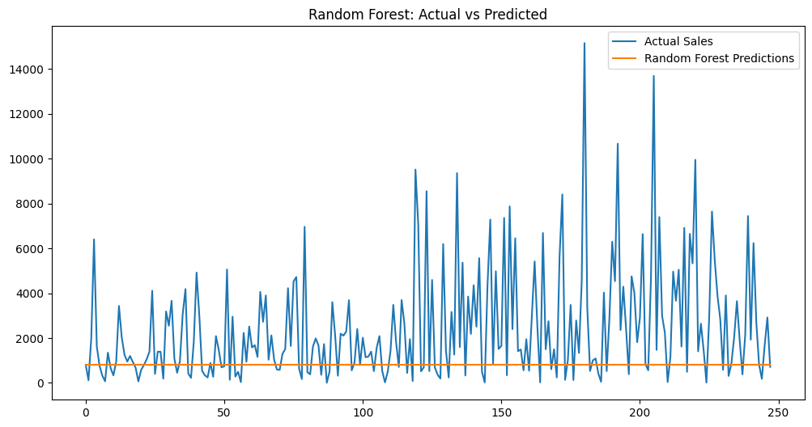
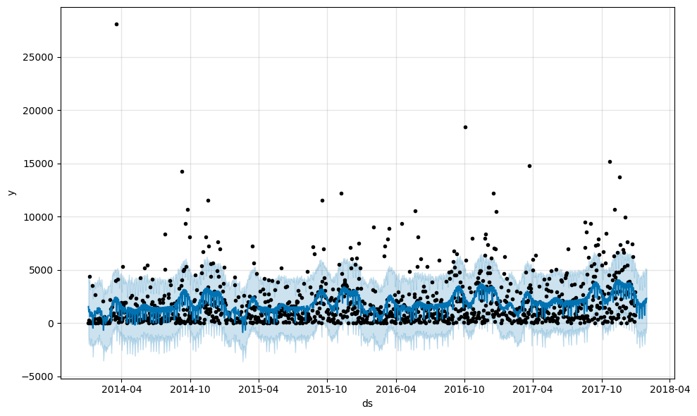
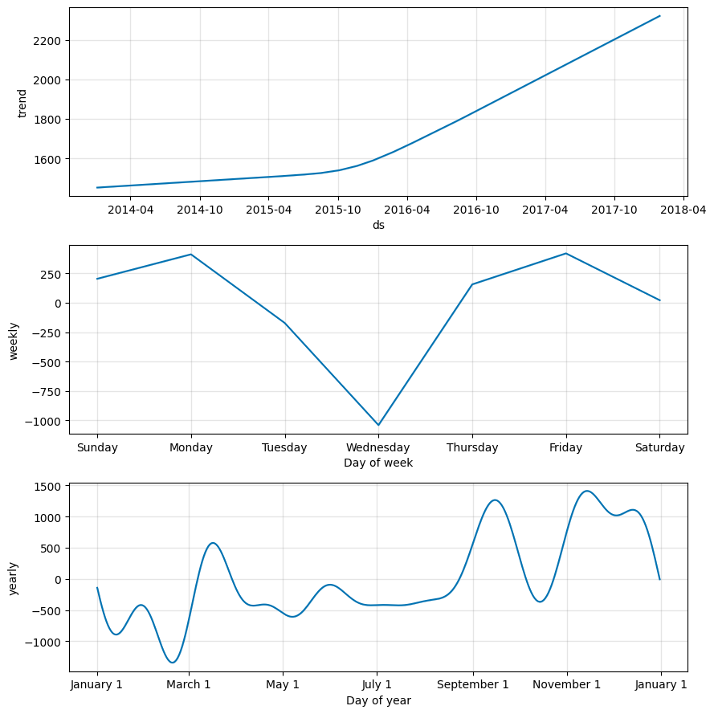
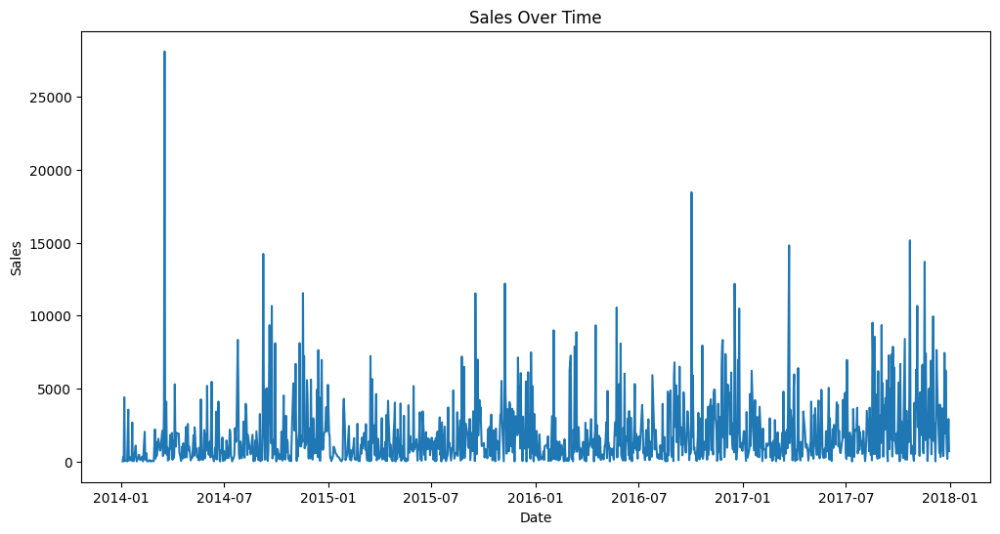

# 📊 Sales & Demand Forecasting Project

## 📌 Overview

This project focuses on building a sales forecasting system using historical retail data. The goal is to predict future sales and provide insights that can support business decision-making such as inventory planning, staffing, and revenue management.

Instead of relying on a single approach, this project explores multiple forecasting techniques to understand how different models perform on real-world data.

---

## 🎯 Objectives

- Analyze historical sales data
- Identify trends and seasonal patterns
- Build forecasting models
- Compare different modeling approaches
- Provide business-friendly insights

---

## 🧰 Tools & Technologies

- Python
- Pandas, NumPy
- Matplotlib
- Scikit-learn
- Prophet

---

## 📂 Dataset

The project uses the Superstore Sales dataset, which contains information on:

- Orders and sales
- Product categories
- Customer segments
- Regions and locations
- Discounts and profit

---

## ⚙️ Project Workflow

1. Data Loading and Cleaning  
2. Handling encoding issues (`latin-1`)  
3. Exploratory Data Analysis (EDA)  
4. Time-based feature engineering  
5. Model building:
   - Linear Regression (baseline)
   - Random Forest (machine learning)
   - Prophet (time-series forecasting)
6. Model evaluation and comparison  
7. Visualization of forecasts  
8. Business insights and recommendations  

---

## 🤖 Models Used

### 1. Linear Regression
- Simple baseline model
- Easy to interpret
- Limited in capturing complex patterns

### 2. Random Forest
- Captures non-linear relationships
- Uses business-related features
- Better at modeling variability
## 🌲 Random Forest Predictions

### 3. Prophet
- Specialized for time-series forecasting
- Captures trends and seasonality
- Provides smooth and interpretable forecasts
## 🔮 Prophet Forecast

## 📊 Prophet Components (Trend & Seasonality)

---

## 📊 Key Insights

- Sales show an overall upward trend over time  
- Demand varies across different days of the week  
- Seasonal patterns exist across months  
- Sales data is highly volatile with frequent spikes  
## 📈 Sales Trend Over Time

---

## ⚖️ Model Comparison

- Linear Regression provides a simple baseline but struggles with complexity  
- Random Forest improves prediction by capturing feature interactions  
- Prophet focuses on long-term trends and seasonality  

Each model serves a different purpose, and combining them can provide better business understanding.

---

## 🚧 Limitations

- Limited features (no promotions or external factors)
- High variability in sales data
- Some models struggle with sudden spikes

---

## 🔮 Future Improvements

- Include additional business features (promotions, holidays)
- Apply advanced time-series models
- Improve hyperparameter tuning
- Use cross-validation for better evaluation

---

## 💼 Business Value

This project demonstrates how data can be used to:

- Forecast future sales  
- Identify demand patterns  
- Support inventory and staffing decisions  
- Reduce business risks  

---

## 📎 Author

**Muhammad Zubairu Rabi’u** 

ML Intern @Future Interns

B.Sc. Data Science Student  

Al-Farabi Kazakh National University

---

## 🚀 Final Note

This project highlights the importance of combining machine learning and time-series techniques to solve real-world business problems.
